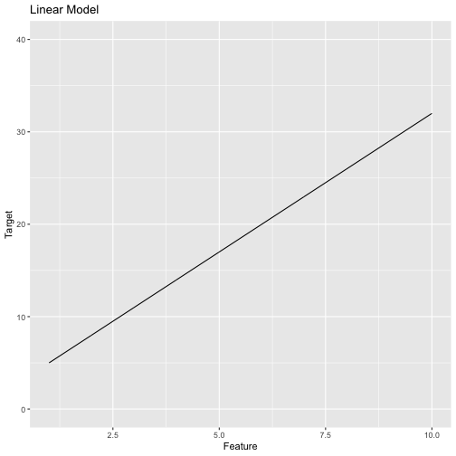
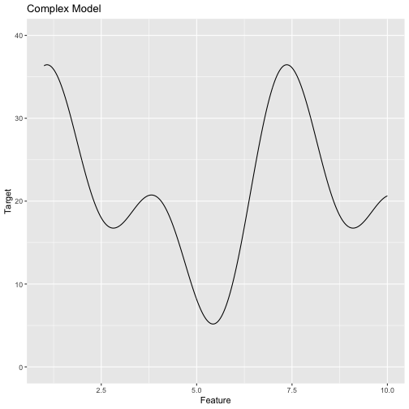
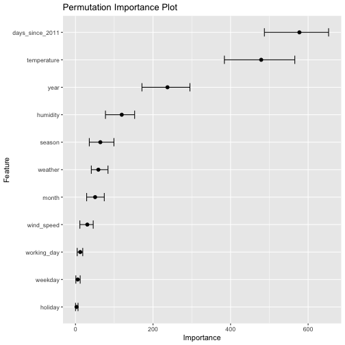
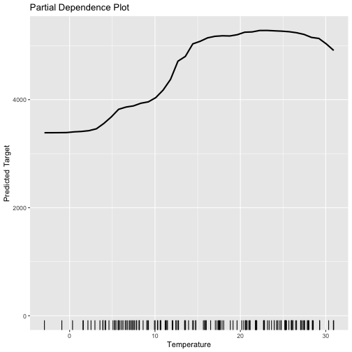
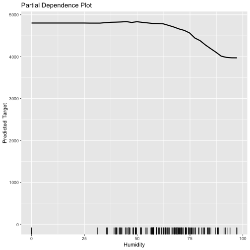
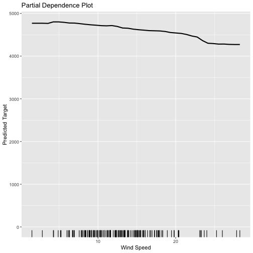
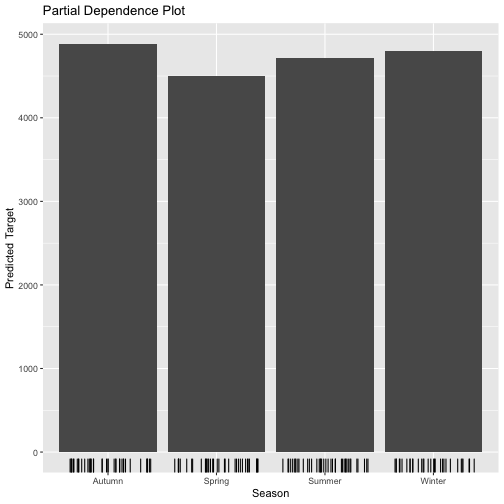
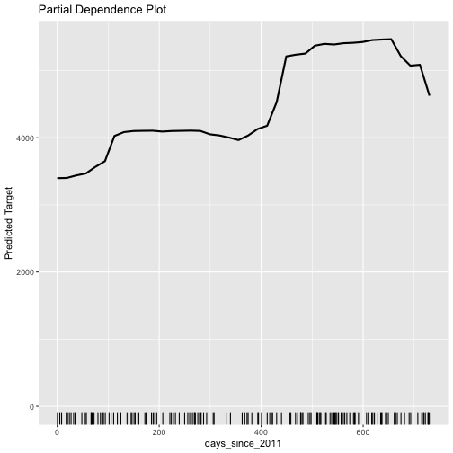
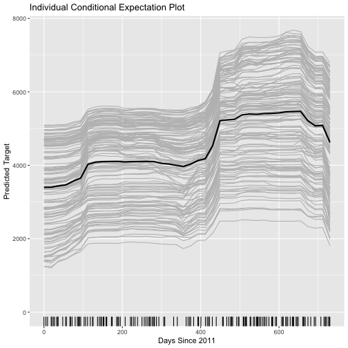
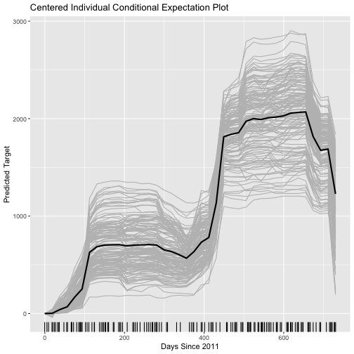

Interpretation of Machine Learning Models
========================================================
author: Matthew Edwards
date: 21st January 2020

<small> 
Data Scientist   
National Innovation Centre for Data   
</small>


Bike Data Set
========================================================

This bike data set contains daily counts of rented bicycles.


```r
data("bike")
```

The bike data set consists of 731 observations (days) and 12 variables. The aim is to predict the **target** variable bikes_rented from the quantitative (e.g. temperature, humitidy and wind_speed) and qualitative (e.g. season) **feature** variables.

<table class="table" style="font-size: 10px; margin-left: auto; margin-right: auto;">
 <thead>
  <tr>
   <th style="text-align:left;"> season </th>
   <th style="text-align:right;"> year </th>
   <th style="text-align:left;"> month </th>
   <th style="text-align:left;"> holiday </th>
   <th style="text-align:left;"> weekday </th>
   <th style="text-align:left;"> working_day </th>
   <th style="text-align:left;"> weather </th>
   <th style="text-align:right;"> temperature </th>
   <th style="text-align:right;"> humidity </th>
   <th style="text-align:right;"> wind_speed </th>
   <th style="text-align:right;"> bikes_rented </th>
   <th style="text-align:right;"> days_since_2011 </th>
  </tr>
 </thead>
<tbody>
  <tr>
   <td style="text-align:left;"> Spring </td>
   <td style="text-align:right;"> 2011 </td>
   <td style="text-align:left;"> January </td>
   <td style="text-align:left;"> No </td>
   <td style="text-align:left;"> Saturday </td>
   <td style="text-align:left;"> No </td>
   <td style="text-align:left;"> Misty </td>
   <td style="text-align:right;"> 8.175849 </td>
   <td style="text-align:right;"> 80.5833 </td>
   <td style="text-align:right;"> 10.74988 </td>
   <td style="text-align:right;color: white !important;background-color: grey !important;"> 985 </td>
   <td style="text-align:right;"> 0 </td>
  </tr>
  <tr>
   <td style="text-align:left;"> Spring </td>
   <td style="text-align:right;"> 2011 </td>
   <td style="text-align:left;"> January </td>
   <td style="text-align:left;"> No </td>
   <td style="text-align:left;"> Sunday </td>
   <td style="text-align:left;"> No </td>
   <td style="text-align:left;"> Misty </td>
   <td style="text-align:right;"> 9.083466 </td>
   <td style="text-align:right;"> 69.6087 </td>
   <td style="text-align:right;"> 16.65211 </td>
   <td style="text-align:right;color: white !important;background-color: grey !important;"> 801 </td>
   <td style="text-align:right;"> 1 </td>
  </tr>
  <tr>
   <td style="text-align:left;"> Spring </td>
   <td style="text-align:right;"> 2011 </td>
   <td style="text-align:left;"> January </td>
   <td style="text-align:left;"> No </td>
   <td style="text-align:left;"> Monday </td>
   <td style="text-align:left;"> Yes </td>
   <td style="text-align:left;"> Good </td>
   <td style="text-align:right;"> 1.229108 </td>
   <td style="text-align:right;"> 43.7273 </td>
   <td style="text-align:right;"> 16.63670 </td>
   <td style="text-align:right;color: white !important;background-color: grey !important;"> 1349 </td>
   <td style="text-align:right;"> 2 </td>
  </tr>
  <tr>
   <td style="text-align:left;"> Spring </td>
   <td style="text-align:right;"> 2011 </td>
   <td style="text-align:left;"> January </td>
   <td style="text-align:left;"> No </td>
   <td style="text-align:left;"> Tuesday </td>
   <td style="text-align:left;"> Yes </td>
   <td style="text-align:left;"> Good </td>
   <td style="text-align:right;"> 1.400000 </td>
   <td style="text-align:right;"> 59.0435 </td>
   <td style="text-align:right;"> 10.73983 </td>
   <td style="text-align:right;color: white !important;background-color: grey !important;"> 1562 </td>
   <td style="text-align:right;"> 3 </td>
  </tr>
</tbody>
</table>

Training and Test Split
========================================================

The bike data set set is split into a training set and a test set with the **rsample** package. The trainiing set is used to train the machine learning (ML) model and the test set is used to test and interpret the ML model.


```r
split <- initial_split(bike, prop = 0.8)
bike_train <- training(split)
bike_test <- testing(split)
```

The training set contains 585 observations and the test set contains 146 observations.

Random Forest Model
========================================================

A **random forest** model is trained on the training set using the **parsnip** package. The parsnip package provides a unified framework for fitting ML models in R.


```r
rf <- rand_forest(mode = "regression") %>%
  set_engine("ranger") %>%
  fit(bikes_rented ~ ., data = bike_train)
```

Testing Model
========================================================

The targets from the test set are compared to the predictions from the random forest model using the **yardstick** package. 


```r
predict(rf, bike_test) %>%
  bind_cols(bike_test) %>%
  mae(truth = bikes_rented, estimate = .pred)
```

```
# A tibble: 1 x 3
  .metric .estimator .estimate
  <chr>   <chr>          <dbl>
1 mae     standard        480.
```

Interpretation
========================================================

**Interpretation** involves understanding how the ML model obtained the predicted targets from the features:

- Which features are the most important for predictive performance?
- How do changes in the features effect changes in the predicted targets?

The ML model is interpreted **NOT** the true feature-target relationship.

Interpretation
========================================================

Since ML models are **functions** that map features to targets, interpretation can be framed as understanding functions. Linear functions require a couple of numbers to describe (i.e. intercept, slope). Linear regression models are termed as interpretable (white box) models.

***



Interpretation
========================================================

Complex functions require more numbers to describe. Possibly one number for every input value! **Plots** display one number for every input value, however, they are limited to functions with one or two inputs. Complex models are termed as uninterpretable (black box) models.

***



Interpretation
========================================================

Assume that there is a complex true feature-target relationship. 

**Complex ML Model**

- Good predictive performance
- Approximate interpretations
 
**Linear ML Model**

- Bad predictive performance
- Perfect interpretations

Approximate interpretations must be approached with causion.

Interpretation
========================================================

So what approximate interpretation methods are there available for complex ML models?

**Model-Agnostic Methods**

1. Permutation importance plots
2. Partial dependence plots
3. Individual conditional expectation plots

Permutation Importance Plots
========================================================

Permutation importance plots are a way of answering the question: which features are the most important for predictive importance?

**Method**

1. Select a feature
2. Permute the values of that feature in the test set
3. Test the model on that permuted test set
4. Calculate the change in predictive performance

Permutation Importance Plot
========================================================


```r
rf %>%
  plot_importance(bike_test, bikes_rented, mae) +
  labs(title = "Permutation Importance Plot")
```



Permutation Importance Plot
========================================================

**Advantages**

- Cross-model comparible
- Accounts for feature interactions
- Does not require re-training

***

**Disadvantages**

- Sensitive to the permutation
- Potentially computational expensive (CI)

Partial Dependence Plot
========================================================

Partial dependence plots are a way of answering the question: how do changes in the features effect changes in the predicted targets?

**Method**

1. Select a feature
2. Select a value $x$ for that feature
3. Replace the values of that feature in the test set with $x$
4. Predict targets $\hat{y}_1,\dots,\hat{y}_n$
5. Average predicted targets $\bar{y}$
6. Plot ($x,\bar{y}$) for a range of $x$

Partial Dependence Plot (qualitative)
========================================================


```r
rf %>%
  plot_dependence(bike_test, temperature) +
  labs(title = "Partial Dependence Plot") +
  labs(x = "Temperature")
```



Partial Dependence Plot (quantitative)
========================================================


```r
rf %>%
  plot_dependence(bike_test, season) +
  labs(title = "Partial Dependence Plot") +
  labs(x = "Season")
```



Partial Dependence Plot
========================================================

**Advantages**

- Very intuitive
- Feature distribution inticates reliability

***

**Disadvantages**

- Maximum of two features
- Assumption of independence
- Some heterogeneous effects are hidden

Individual Conditional Expectation Plot
========================================================

Individual conditional expectation plots are also a way of answer the question: how do changes in the features efefct changes in the predicted targets?

**Method**

1. Select a feature
2. Select a value $x$ for that feature
3. Replace the values of that feature in the test set with $x$
4. Predict targets $\hat{y}_1,\dots,\hat{y}_n$
5. Plot $(x,\hat{y}_1),\dots,(x,\hat{y}_n)$ for a range of $x$

Individual Conditional Expectation Plot
========================================================


```r
rf %>%
  plot_dependence(bike_test, days_since_2011,
    examples = TRUE,
    center = TRUE
  ) +
  labs(title = "Partial Dependence Plot") +
  labs("Days Since 2011")
```



Individual Conditional Expectation Plot
========================================================

**Advantages**

- Very intuitive
- Feature distribution inticates reliability
- No assumption of independence
- Some heterogeneous effects are revealed
- Can include partial independence plot

***

**Disadvantages**

- Maximum of one feature

Conclusion
========================================================

- Interpretation involves understanding ML models
- Complex ML models can only be interpreted approximately
- Model-agnostic methods provide these interpretations
- Interpretations are not of the true feature-target relationship

**Presentation:** https://mt-edwards.github.io/interpret

**Package:** https://github.com/mt-edwards/xrayspecs

<small>
**Interpretable Machine Learning**   
A Guide for Making Black Box Models Explainable.   
Christoph Molnar   
</small>
